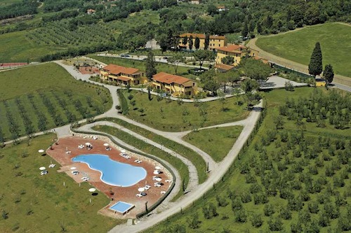

<small>Our flat in [Belmonte Chianti](http://www.tuscany-farmholiday.com/)</small>

When on vacation, and interacting with other
travelers or natives, the following question inevitably comes up:

*"So, how long are you here for?"*

And of course, the nationality guess. What I've found, is that most can
believe one of my answers, but not both of them together.

*"American."* and *"About 5 1/2 weeks"*

Double-take. Happens every time.

Part of the reason is the travelers I'm surrounded by at the moment. All
Europeans. Dutch (my son and I can count to 10 now in 4 languages),
German, Swedish, and of course Italians. For two weeks of our trip I've
chosen the [Tuscany holidays](http://www.tuscany-farmholiday.com/) route at an
Aguriturismo. I'll be posting a more in-depth review of my experience
and some tips for my westward homeland inhabitants should they choose
this route. My son and I have been having a blast, there are mostly
families here, with kids close to his age. It's been relaxing, feels
like a second home, and we've met many fun and interesting people from
all over.

<!--more-->

Another reason, the length. The normal track for an American traveler is
10 days, 2 weeks tops. Our puritan work ethic usually deems two weeks
the absolute limit on yearly vacations for our working folk. One of our
new Dutch friends told me they receive 6 weeks ... yes ... six (**zes**
in Dutch btw).

Lastly, the choice of an Aguriturismo. An Italian friend of mine had
initially suggested it, and while I had looked into it, I never made any
firm plans to stay in one. In fact, when I got on the plane at LAX with
my son on our way to Milano airport, the only thing I knew for sure was
our first couple of nights would be with family. Nothing else was
booked, we got up each morning and listened for what sounded fun our
interesting, and we navigated in that direction. These destinations are
very popular with Europeans. Many of our new friends told us they do
this every year as part of their vacation. They forever have held this
vision of the American I described in [The Magic of Italy](http://andrew-lombardi.com/writings/the-magic-of-italy) as the
individual taking a photo near every monument and rushes through their
"vacation" with an itinerary that feels like more of a chore to me than
relaxation. I will happily pass by several must-see spots and take a
seemingly random picture. When I shoot photos during my travel, the
photo is merely an anchor to assist me in feeling what it was like while
I was there.

It has been an interesting conversation I've had numerous times now.
Obviously there is a mold out there for how and what a normal American
does during their whirlwind European vacations. Anyone who knows me can
attest, I'm not normal.

And I'm perfectly okay with that. Are you embracing your version of not
normal? Mine came with an incredible view and a gorgeous pool.

*La dolce vita!*
