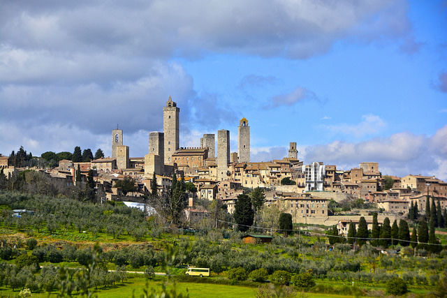

<small>Sunset just outside San Gimignano in Tuscany, Italy</small>

*"Daddy, what does heaven smell like?"*

I sat with my son just outside St. Peter's Basilica
in Rome. Since we arrived in Italy a few weeks before, he had been
asking these questions -- nothing that you would attribute to musings
from a five-year old. How would you ever explain this concept? Even if
you believe in heaven and hell, it's a question that would probably
baffle most people. We are often regaled in stories of the sights and sounds of this afterlife, but never the smell or taste -- and not often what it would feel like.

<!--more-->

So we have a large percentage of the population, who are besotted with a
magical location after death that is missing two maybe even three of the
five senses! I would love to read someones fictional narrative on the
smells and tastes that would accompany a visit to the land of the
clouds. Will we be entranced with constant smells of freshly baked
bread, and an ever-flowing river of chocolate with perhaps the best
gelato one could imagine?

What if, none of these things are smells you particularly like? Is there
a district for coffee lovers? A special place for those who love the
smell of barbecue on a hot summer day? Certainly there must be districts
for the various ethnic foods that have distinct tastes and smells
beloved by the inhabitants. Could you even hope to please everyone with
their idea of what heaven would be?

Would being surrounded in things that you had liked while you were
living be enjoyable for eternity? Variety and the differences between
the people we meet are "the spice of life". The experiences that I've
treasured having in this life have been vast and unique, and everything
born from engaging in an alternate plane to my comfort zone.

Finally, I answered *"I don't know, nobody alive does. Perhaps we can
imagine some smells that would be good! What do you think?"*

*"Chocolate."*

*"Amen."*

What does your heaven smell like?
