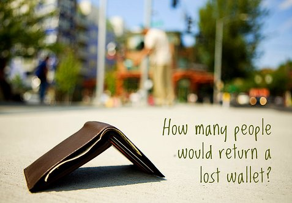

I spent all day shooting photos around Stockholm.

This is not unlike most days I spend while traveling abroad. And when I
turned on the street for the hotel, I felt a finality to a good day. I
relaxed horizontally on a couch to rest for a few moments, heavenly. A
few moments into my slumber, my hand reached down to my right front
pocket which felt surprisingly light. That's when my world fell apart.
Seeing a fair bit of panic the old Swedish man sitting across from me
near the fireplace asked me something in Swedish. "I think I lost my
wallet..." From restful to panic in only a few moments.

<!--more-->

You never quite realize how important the items in your wallet are,
until they are lost. Money, identification, credit cards, freedom to
engage in activities while abroad. I quickly ran through in my mind the
companies I'd have to call and plead to somehow send me a new card, or
getting someone to wire me some money so I could continue. I've run up
to the front desk, asking if they've seen my wallet. We all chatted
before I left for my photo morning, and no one has seen it. Rachel, one
of the women who works behind the counter started to help me think
through where I had been, and could it be in my bags? or left in the
room perhaps? We walk to the baggage area, and as I checked both bags I
had left, nothing.

Our conversation going up to the room was hopeful, and that wasn't
coming from me, but my partner who could prod me into thinking
different. Entering the room, I instantly know that it isn't here, I
retreat and look anyway. As I'm opening the cupboards and closet spaces,
I glance at the safe. And then it hits me.

My passport is still in this safe.

Upon leaving the room, I tell Rachel that I haven't found my wallet. And
she suggests one more check of my bags. I'm not hopeful.

Upon looking through my bags, I have a sinking feeling that this is
going to be a painful final 2 1/2 weeks. And then I reach into my jacket
pocket and find a bottle of baby powder.

BABY POWDER! I just bought this down the street!

I couldn't run to the Apotheket fast enough, and as I sail into the
shop, looking to my left, I ask about my wallet. We say the name in
unison and we all breathe a sigh of relief together. I thank them
profusely, and start my trek back to the hotel. I do have a plane to
catch after all.

For fun, I walk into the hotel with a down face and a somber look, one
of the girls asks immediately upon recognizing me if I had found the
wallet. She reads no in my face, and I finally pull out the wallet and
we all laugh in relief.

So, if it wasn't for buying the powder and losing my wallet, I would
likely have not had my passport and missed my flight. And if I hadn't
checked my bags a second time, I wouldn't have grazed my hand over the
bottle of baby powder and remembered where I left my wallet. And without
the help of strangers in a strange land, the whole thing would have been
much more difficult.

As I sprint with my bags from Terminal 2 at Arlanda Airport to Terminal
5 and round the corner to my gate, I'm beaming with happiness. People
inherently are good natured and want to help you. And your mind is quite
brilliant, if you choose to pay attention to what it's telling you.
