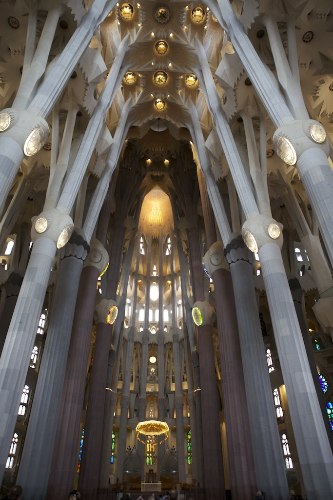

When you visit a new city, one of the oft mentioned locations to visit
mentioned by friends, churches. Many are beautiful, some are grand,
others are just old and evoke an emotion because they've withstood the
test of time. Most travelers use them to "check the box" next to "seen
it" on their ever growing list of what you must see when visiting a new
locale.

*La Sagrada Familia* is an adventure.

<!--more-->

Upon exiting the metro, a quick look around shows an amusing picture of
hundreds of people looking, up. And as you follow their gaze one cannot
help but angle your neck and stare in complete awe. The basilica is
unique and gives off a first impression unlike any other church I've
seen in the world. St. Peter's, in the Vatican, was the only other
church I have visited where upon viewing it was taken aback in awe and
wonderment. And yet, this church was something more, it wasn't mega or
well-known to me, it was not architecture you expect from a catholic
church.

I spent the better part of an hour outside. Upon the advice of a friend
who had visited Gaudi's church and she spoke of the story and history
behind the church as immensely interesting, I decided to buy an audio
guide. I never do that. The guide though, was entertaining, and had me
pouring over little details, the facade, the magic square that adds up
to 33 (Jesus's age of death). As I hit 4 on my audio guide, it
instructed me to walk inside.

It was breathtaking.

From the colored glass, to the tree-like columns, the flower adorning
the ceilings, the spiral staircase that evoked a snail. My first
reaction to this church was so strong, I was a bit emotional, and stood
a few steps inside the church in the same place for a long time. Walking
through the church with the audio guide droning in my ear, I marveled at
the littlest details. As I walked it was clear that nature played a huge
role in Gaudi's architecture which was only further solidified by the
exhibition they have on the far end of the church detailing all of the
numerous ways he used nature in his design. The rear exit of the church
brings you yet another facade, completely different style, and equally
marvelous.

I took many pictures of the church, inside, outside, but I've only
looked at a few as I don't quite know how anyone could capture or evoke
the emotion that comes from seeing this place. One of the most
fascinating things about this masterpiece is, it isn't finished. And
Antoni Gaudi has been dead for nearly a century. When he was still
alive, he knew he couldn't finish it and left instructions as to how he
wished the remainder would be constructed and designed. And there have
been additions to the church toward that end goal ever since.

As things to see go, I am overjoyed that I decided to see this while in
Barcelona. It isn't to be missed.
