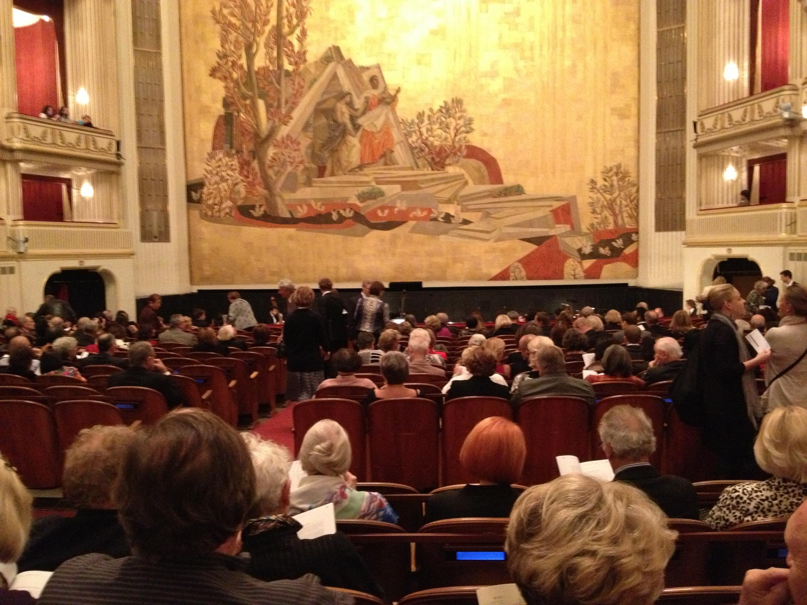

How do you get to Carnegie Hall? Practice.

How do you get to Staatsoper Wien? Either you pay over 100€, or you pay
with your time, and a bit of comfort, by standing in line four separate
times, the last being paired up before finally walking into the
performance space.

The most magical thing about Vienna so far<!--more-->, was my
introduction to the world of opera by way of Mozart's "Don Giovanni". An
Italian sung opera, with translations in German and English being
streamed just below where my scarf lay in wait, to be reapplied to the
neck after serving its spot-saving task for the night. The hours spent
in line were shortened considerably by the Icelandic girl who travels
and lives longer in most places other than her home, her sister the
classical singer who loves Mozart, and the Indian girl who lives in
London, from Bombay, and is traveling Europe for the next 45 days.
Entertaining even was the Austrian man in front of me who spoke briefly
to answer the question of "when does the performance start?" and then
chose to never speak again. And even the Moby look-alike who I was
paired up with to enter the theatre, but kept his nose firmly planted in
a German-written book, which apparently was quite hilarious.

Standing next to me during the performance was a lovely Austrian woman
who had seen the performance a few years ago, before they changed it,
and a Chilean flute player who had performed this particular opera,
studied under one of the players in the production, and hoped one day to
perform at the Staatsoper in Wien. Adding color for the evening was a
40-year veteran performer of opera from Philadelphia who pegged me as a
singer or musician of some kind because of a voice that he remarked held
lots of resonance. We talked several times during intermission, before,
after, and he proved to be a handy guide.

Don Giovanni was simply a breathtaking performance. At times I was left
feeling like I should watch the translations while eagerly paying
attention to the stage, and the beautiful music. When I learned enough
in the intermission to read a synopsis of the opera on the internet, I
leaned head in hands and reveled at the voices and instruments that
echoed deep into my heart. It was a lovely night with only the mildest
discomfort at standing for hours, and the large payoff of an experience
I'll never forget. At times you felt a kinship, then a disgust, and
finally perhaps a bit of sadness for Don Giovanni. He was a man who gave
no apology for his wanton desire, and left many in heartbreak and
distraught throughout his reign. Such a powerful opera for my first,
looking forward to more.

I may be inclined to repeat this voyage on Friday as well, for the
experience proved more than worthy of my time. On a train to Salzburg
for the day, and I may be found frolicking up a hilly slope singing
songs no Austrian has heard for a thousand years, but have become
inundated with over what probably seems long enough since that movie.

So long, farewell, auf wiedersehen goodnight...
