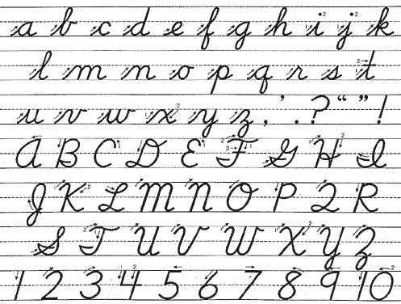

<small>Image from [Sunset Ridge Elementary School][]</small>

This morning I read an [article][] at Yahoo about a handful of states --
California, Georgia, and Massachusetts are adding cursive as a
requirement in the curriculum. And while these select states are
ensuring children will learn this skill, other states are leaving it
optional (read: don't bother) like Indiana, Illinois, and Hawai'i.

<!--more-->

The article hinges on an argument that in the age of technology, where
typing, and texting, and computer usage has flourished, who needs this
archaic method of capturing thoughts on paper? And for that matter, who
uses paper anymore? Or being able to add / subtract / multiply / divide
in your head? Just use a calculator, duh! They call out "experts" who
proudly proclaim that in the age of computers, typing is more important.

Deplorable. Typing is definitely a skill that most kids should have, and
probably already do have without help from a school (and no, I'm not
talking about thumb wars on your mobile phone typing LOL, that doesn't
count). Does typing benefit your brain in any positive way equivalent to
cursive? No. It's a simple skill that only utilizes one hemisphere of
the brain, while cursive crosses the corpus collosum and fosters both
hemisphere brain development.

Cursive is a vital skill to help build the cognitive ability of a child.
Fine motor skills are enhanced greatly through cursive writing. Forming
letters by tracing and later your own spatial abilities, using differing
shapes, sizes, and angles all while focused intently on the task at
hand. It is essentially linking together our motions and movements of
the body, with the mind in a way that typing and block letter writing
don't achieve.

If we're looking to raise children as only minds without bodies, by all
means, no more cursive, and don't bother learning your times tables. I
see a different future for our kids. Whole brain learning tied together
with sensory motor activities involved with writing cursive, should be
mandatory in every state. And we should rethink calling anyone an expert
who espouses the dumbing down of our children by removing a skill that
does so much, so early in their life.

Teach the whole child.

And if you'd like to utilize technology and marry it with the skills of
cursive writing, [Cursive Touch and Write][] is an iOS app which can
teach your kids how to write cursive in a fun way, that sticks (I'm not
affiliated in any way with the app developer). This isn't an either/or
world, technology can be used to enhance teaching methods that already
exist today.

  [Sunset Ridge Elementary School]: http://www.mcpasd.k12.wi.us/sunsetweb/resources/cursive.cfm
  [article]: http://news.yahoo.com/states-preserve-penmanship-despite-tech-gains-190737500.html
  [Cursive Touch and Write]: https://itunes.apple.com/us/app/cursive-touch-and-write/id528183660?mt=8
